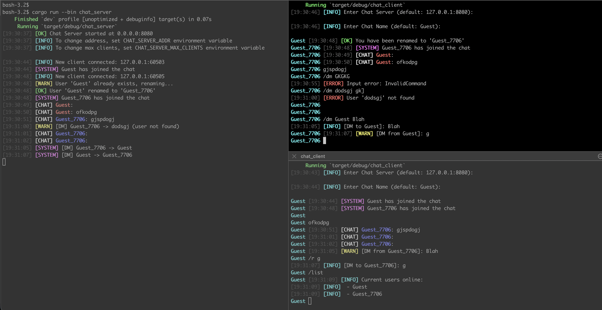

# rust_chat

A modern, colorful terminal-based chat application written in Rust with async/await support.



## Features

- 🎨 **Colorized Output** - Beautiful, color-coded terminal interface with timestamps
- 👥 **Multi-user Support** - Multiple clients can connect simultaneously
- 🔄 **Real-time Messaging** - Instant message broadcasting to all connected users
- 🏷️ **Username Colorization** - Each user gets a unique, consistent color
- ⚡ **Async I/O** - Built on Tokio for high-performance async networking
- 🔧 **Modular Architecture** - Clean separation between client, server, and shared code
- 🛡️ **Smart Username Handling** - Automatic renaming for duplicate usernames
- 📊 **Rich Logging** - Categorized logs (INFO, ERROR, WARN, OK, SYSTEM, CHAT)

## Architecture

The project is organized into three crates:

- **chat_client** - Terminal client application
- **chat_server** - Multi-threaded chat server
- **chat_shared** - Shared code (message protocol, networking, logging)

## Requirements

- Rust 1.75+ (edition 2024)
- Cargo

## Quick Start

### Starting the Server

```bash
cargo run --bin chat_server
```

The server will start on `0.0.0.0:8080` by default.

#### Server Configuration

Configure the server using environment variables:

```bash
# Custom address and port
CHAT_SERVER_ADDR="127.0.0.1:9000" cargo run --bin chat_server

# Custom max clients
CHAT_SERVER_MAX_CLIENTS="50" cargo run --bin chat_server
```

### Starting the Client

```bash
cargo run --bin chat_client
```

You'll be prompted to enter:
1. **Server address** (default: `127.0.0.1:8080`)
2. **Username** (default: `Guest`)

## Usage

### Chat Commands

Once connected, you can use the following commands:

- `/help` - Display available commands
- `/quit` - Exit the chat application
- `/list` - List users
- Any other text - Send a message to all connected users

### Example Session

```
[12:34:56] [INFO] Enter Chat Server (default: 127.0.0.1:8080):
[12:34:58] [INFO] Enter Chat Name (default: Guest):
Alice
[12:34:59] [SYSTEM] Alice has joined the chat
Alice █

[12:35:02] [SYSTEM] Bob has joined the chat
Alice hello everyone!
[12:35:05] [CHAT] Bob: hi Alice!
```

## Project Structure

```
rust_chat/
├── chat_client/
│   └── src/
│       ├── main.rs          # Entry point and setup
│       ├── client.rs        # Client logic and message handling
│       └── input.rs         # User input processing
├── chat_server/
│   └── src/
│       ├── main.rs          # Server entry point
│       └── user_connection.rs # Connection handling
└── chat_shared/
    └── src/
        ├── lib.rs           # Module exports
        ├── logger.rs        # Colorized logging utilities
        ├── message.rs       # Message protocol
        └── network.rs       # TCP message handling
```

## Features in Detail

### Colorized Logging

All output is color-coded by category:
- **INFO** (Cyan) - General information
- **OK** (Green) - Success messages
- **ERROR** (Red) - Error messages
- **WARN** (Yellow) - Warnings
- **SYSTEM** (Magenta) - User join/leave notifications
- **CHAT** (White) - Chat messages with colored usernames

### Username Colorization

Each username is assigned a consistent color using hash-based selection from 12 vibrant colors. The same username always appears in the same color, making it easy to follow conversations.

### Smart Username Handling

If you try to join with a username that's already taken, the server automatically appends a random 4-digit suffix (e.g., `Alice_1234`).

### Message Protocol

Messages are sent over TCP with a custom chunked protocol that supports:
- Join notifications
- Leave notifications
- Username renames
- Chat messages

## Building

### Development Build

```bash
cargo build
```

### Release Build

```bash
cargo build --release
```

### Running Tests

```bash
cargo test
```

### Code Quality

```bash
# Run clippy
cargo clippy --all-targets --all-features

# Run with strict warnings
cargo clippy --all-targets --all-features -- -D warnings
```

## Dependencies

### Core
- **tokio** - Async runtime
- **colored** - Terminal colors
- **chrono** - Timestamp formatting

### Server-specific
- **rand** - Random username generation

## Contributing

Contributions are welcome! Please ensure:
1. Code passes `cargo clippy` with no warnings
2. Code is properly formatted with `cargo fmt`
3. All tests pass with `cargo test`

## License

This project is available for educational and personal use.

## Future Enhancements

- [ ] Private messaging
- [ ] Chat rooms/channels
- [ ] Message history
- [ ] User authentication
- [ ] File sharing
- [ ] Encryption
- [ ] GUI client
